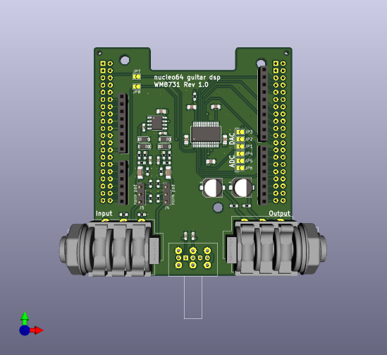

# Nucleo guitar DSP

A STM32 Nucleo expansion board to transform your Nucleo board into guitar effect
processor.

## Description

This is a STM32 Nucleo expansion board to turn Nucleo Development board into
a guitar effect processor. It's designed targeting specifically the
nucleo-f441RE board while being usable with other boards, so it may be usable
with most nucleo64 and nucleo144 board.

## Some features:
 * can be used with passive or active guitar, thanks to j4 and j5 selectors
   (mini switches can be used instead of pin headers and jumpers).
   * "norm" is for passive guitar and voltage source below 1vrms. Input
     impedance is ~1 Megohm
   * "pad" is for active source with voltage higher than 1vrms, It apply ~18db
     attenuation. Input impedance is 37 ~ 38kohm.
   * J4 is for left channel and J5 for the right channel. 
 * Stereo input, so it can be used for stuff other than guitar.
 * Output usable with headphone.

## Setup solder bridge

I assume a Nucleo-f411re board. Depending the used Nucleo board, pinout can be
different and things can have different name or may even not exist. Check
various datasheet before doing anything.

JP1 - JP3, connect ADC output to a i2s serial data pin:
 * JP1 connects to PB15 (I2S2_SD)
 * JP2 connects to PB14 (I2S2ext_SD)
 * JP3 connects to PC12 (I2S3_SD)

JP4 - JP6, connect DAC input to a i2s serial data pin:
 * JP4 connects to PB15 (I2S2_SD)
 * JP5 connects to PB14 (I2S2ext_SD)
 * JP6 connects to PC12 (I2S3_SD)

JP7, connect PB13 (I2S2_CK) and PC10 (I2S3_CK), required when I2S3 is used

JP8, connect PB12 (I2S2_WS) and PA4 (I2S3_WS), required when I2S3 is used

Note: only I2S2 peripheral can be used as master.

## Missed consideration
In this first version, i missed or forgot some consideration:

 * **No output to output protection:** it mean boards can be damaged by a wrong
   setup. Putting resistor instead soldebridge on some solder jumper reduce the
risk 
